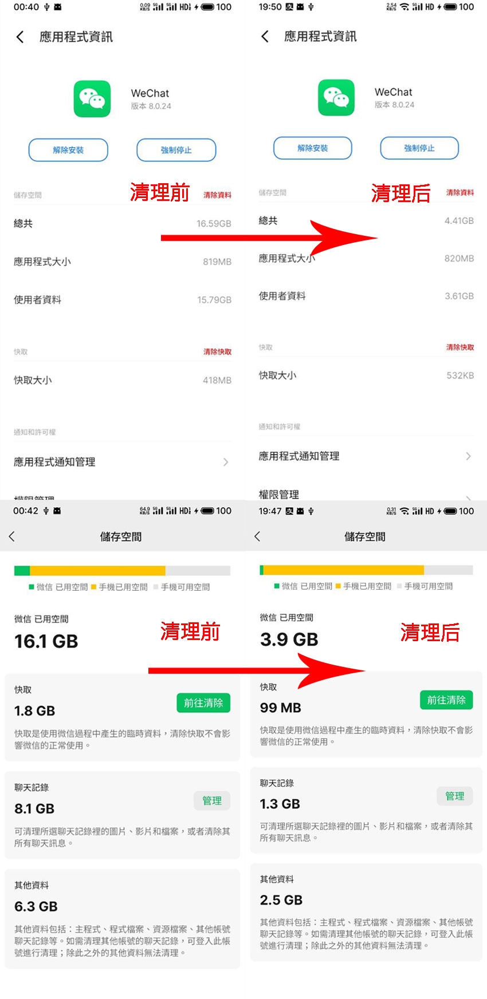

# wechat-clean

释放你的安卓微信内部存储空间，一键解放微信存储空间的工具。


# 介绍

**主要原理：**

通过解密微信的数据库，过滤出群聊天记录，并找出相关的缓存文件、图片、视频等，一并删除。最后，删除这些数据库记录，从而缩减数据库的大小。

**为什么会做这个？**

由于记忆力有限，可能不想删除所有的聊天记录，而是希望保留联系人记录，以便在需要时可以参考上下文。

然而，微信甚至不像 QQ 那样，可以手动点击接收图片。微信默认会接收所有群组的消息、图片和视频缓存等，群里聊的每一个字节都存到了你的手机里。

此外，微信的文件分类管理非常混乱，这些文件甚至被隐藏在 `/data` 目录中，只有具备 root 权限的用户才能进行处理。即使你有 root 权限，也无法轻易找出哪些文件可以删除，哪些文件不能删除。

长期以来，虽然你的联系人资料可能并不占用太多存储空间，但群组的资料却可能占据了大部分空间。

**为什么你不退群？**

没有习惯退群，即使退了，群组之前的记录仍会像狗皮膏药一样永远存储在你的手机中，无法轻易清除。

**为什么不用内置聊天管理？**

内置的聊天管理功能根本无法满足清理需求，缺乏一键选择群组的功能。

经过测试，即使勾选了清理选项，导出数据后你会发现数据库和缓存中仍然存在数据，内置功能并没有完全清理干净，就像删除了一个软连接一样。（测试自 8.0.2 版本）

**功能：**

- 清理所有群产生的聊天记录、图片、视频和音频缓存，从而缩减数据库大小。
- 可选择只清理联系人，这一功能一般用不上。
- 顺便清理其他目录：小程序、基础缓存、检查更新残留、record 缓存、avatar缓存、FTS5Index*、webview 内核缓存、wepkg 缓存等。
- 清理其他表项：公众号推送列表、转发通知消息、已经删除的关联记录表、用户头像关联缓存等。


# 效果

这是搞了好几天的成果，虽然结果还是很大，但已经减少了十几GB的体积！好在是可以弄成一键工具进行清理了。




# 编译

文件编译

```bash
env GOOS=android GOARCH=arm64 CC=C:\android-ndk-r25c-windows\android-ndk-r25c\toolchains\llvm\prebuilt\windows-x86_64\bin\aarch64-linux-android30-clang GOARM=7 CGO_ENABLED=1 go build
```

push

```
adb push wechat-clean /data/local/tmp
```

# 备份

**推荐钛备份**，可以全量备份版本及用户数据

下载：https://play.google.com/store/apps/details?id=com.keramidas.TitaniumBackup&hl=zh&gl=US

## 命令行手动备份

截取自钛备份, **不包含 sdcard 数据**

```
busybox tar -c /data/data/com.tencent.mm/. --exclude data/data/com.tencent.mm/./lib --exclude data/data/com.tencent.mm/./cache
```


# 开始

## 注意⚠️⚠️⚠️

- Android 设备必须拥有 root 权限
- **使用前请先备份数据！**
- 你必须为你自己数据清理过程中产生意外错误后自己负责，如执行中断、超范围删除等。
- 测试环境在 8.0.24 验证通过

## 执行流程

1. 请先想办法获取你的数据库密码！
2. 下载文件 wechat-clean 到`/data/local/tmp` 中
3. 提权到 **root 权限** `su`
4. 给程序赋予执行权限`chmod +x wechat-clean`
5. 找到你的微信32位用户ID
6. 结束微信进程 `ps -ef|grep com.tencent.mm|grep -v grep| awk '{print $2}'|xargs kill -9`
7. 执行扫描 `./wechat-clean -id [32位用户ID] -key [7位密码] -from groups -cmd scan`


## 获取用户微信32位ID

如果你只登陆过一个用户那非常简单，执行命令就能看到一个长度32位 ID 的目录

```
ls /data/data/com.tencent.mm/MicroMsg/
```

## 获取数据库 KEY

### hook方法获取

你可能需要学习 frida 相关基础知识和流程。

启动微信后，执行命令会输出密码

```bash
frida -U -n Wechat -l wechatdbpass.js
```

### 计算方式

需要找出你的 imei 和 uin，相关网上资料很多，但不一定能够计算出来。

如果你换过手机并迁移数据，这个 imei 可能早就就变了，并不是当前手机IMEI。

```python
import hashlib

imei = "866123456789111"
uin = "-123456789"
key = hashlib.md5( str( imei ).encode("utf8") + str( uin ).encode("utf8")).hexdigest()[ 0:7 ]
print(key)
```


## 其他用法

```bash
./wechat-clean -h

Wechat-Clean v20230719

Usage of D:\projects\wechat-clean\wechat-clean.exe:
  -cmd string
        scan/clean/server (default "scan")
  -from string
        groups/friends/all
  -id string
        user 32 length hex id
  -key string
        db key
  -user int
        Android user id
  -vd string
        Vacuum db full path
```

### 扫描

扫描垃圾文件只是读库读文件，是一个安全行为。

```bash
./wechat-clean -cmd scan -id [32位用户ID] -key [7位密码] -from all
```

### 清理群相关记录

**本程序最适合也只建议清理群消息。**

```bash
./wechat-clean -id [32位用户ID] -key [7位密码] -from groups -cmd clean
```

### 精简数据库

不会删除数据，只是释放已经删除数据的空间，同 sqlite 命令：vacuum

```
./wechat-clean -vd /data/data/com.tencent.mm/MicroMsg/*****/EnMicroMsg.db -key 1122334
```

vacuum 只会将已经删除记录空间释放，如果没有删除是无法缩减的。

> sqlite + sqlcipher 在Android上执行 vacuum  时，会把数据库吞进内存处理，内存几乎是文件的2倍，然后涨到2.5G左右时被OOM或者其他系统机制干掉，具体原因不明。

对于数据库大于 1GB 的文件将在 clean 排程中跳过，你需要将 EnMicroMsg.db 通过 adb复制到 windows 等，缩减后再放回去。

以下参考：

```bash
android #
cp /data/data/com.tencent.mm/MicroMsg/****/EnMicroMsg.db /data/local/tmp

win #
adb pull /data/local/tmp/EnMicroMsg.db .
./wechat-clean -vd /data/data/com.tencent.mm/MicroMsg/*****/EnMicroMsg.db -key 1122334
adb push EnMicroMsg.db /data/local/tmp

android #
cp /data/local/tmp/EnMicroMsg.db /data/data/com.tencent.mm/MicroMsg/****/EnMicroMsg.db
```


### UI界面手动清理

以服务器形式启动，通过手机或者同一个局域网下的电脑可以进行访问执行操作。

**默认端口为 9999 请避免端口占用。**

只需要如下参数即可启动：

```bash
./wechat-clean -id [32ID]  -cmd server -key [7key]
```
支持操作：
- 搜索昵称备注
- 全选/取消全选所有好友
- 全选/取消权限所有群组
- 单选任意会话


## 其他

记录一些快捷指令

### 查看子目录占用大小

```
android:/data/data/com.tencent.mm # du -h -d 1
3.5K    ./code_cache
499M    ./files
2.0G    ./MicroMsg
3.5K    ./app_lib
3.5K    ./app_dex
3.5K    ./app_cache
3.5K    ./app_recover_lib
1.4M    ./shared_prefs
```

### 冻结恢复应用

在执行 clean 时程序会自动冻结你的程序并在完成后恢复，如果意外没有恢复，你可以手动执行。

**冻结应用**

```
adb disable com.tencent.mm
```

**恢复应用**

```
adb enable com.tencent.mm
```

### IOS 用户

对于没有 root 的 Android 或者 IOS 用户来说无法实现，一般也没有必要天天清理，可以按照以下方法一年一清。

1. 将使用的 IOS 微信备份到 PC 微信，选择全部聊天记录。
2. 在已经 root 的 Android 设备上登录微信并恢复聊天记录到本地。
3. 通过脚本清理群组聊天记录（建议提前备份有基础密钥的基础数据库，可以减少重新获取密钥的工作）
4. 将清理后的微信备份到PC微信，如果该设备备份过，在PC端点击删除备份，否则是追加，会有垃圾的。
5. 在IOS设备重装微信，登录后从 PC 微信恢复精简后的全部聊天记录。

**或者许愿未来哪一天宇宙级产品经理愿意实现自定义备份功能了，就有解了！**

# 数据表

**以下给我自己看的！备忘录！！！**

| 表名                      | 描述                                                         | 可清理             |
| ------------------------- | ------------------------------------------------------------ | ------------------ |
| AppMessage                | 应用消息, 可能是通知, 邀请信息之类的, 有 title 和 description 字段 | 垃圾可清, 量大     |
| fmessage_conversation     | 好友申请记录                                                 | 无需清             |
| rcontact                  | 联系人和群组表，含昵称、原始ID                               |                    |
| message                   | 聊天记录                                                     |                    |
| MediaDuplication          | 一部分外置资源图片, 5k行                                     | 可清不存在的记录   |
| ImgInfo2                  | 图片总表                                                     |                    |
| videoinfo2                | 视频总表                                                     |                    |
| appattach                 | 一部分下载的文件、一部分图文聊天记录的转发？                 | 可清理，内容几百条 |
| ChatroomNoticeAttachIndex | 聊天记录转发产生的HTM文件，路径不存在可请                    | 可清不存在的记录   |
| EmojiInfo                 | 表情、贴图表                                                 |                    |
| CleanDeleteItem           | 删除的项目，看名字就可以删除                                 | 全清               |
| img_flag                  | 用户的头像映射                                               | 全清               |
| BizTimeLineInfo           | 公众号的推送会话列表                                         | 全清               |
| rconversation             | 最近会话列表                                                 | 无需清             |


## 查找文件方法：

根据 type 区分文件类型

## 图片和视频

1. 在message表找到对应记录，拿到 msgsvrid、msgId 
2. 通过 ImgInfo2 或者 VideoInfo2 查找  msgsvrid=236411111111111111;
3. 找到缩略图、中图、大图、hevc图的 filename，拿到 filename，图片的话在 image2 目录，文件名前4位是两级子目录名。
4. 视频的话再去对应外置存储路径中如 video/230621111111111111.mp4 删除，可能也有 video/230621111111111111.jpg 为缩略图
5. 也可以跳过中间表，直接用 imgpath 去找。如果要删除的话记得删除中间表的数据，也挺大的。


## 音频文件

1. 在数据库拿到文件名 54155907092311111111111111

2. md5之后 = **c952**9f3187f2afbbf742249baccac089

3. 外置路径就是 =  voice2/**c9/52**/msg_54155907092311111111111111.amr


## message

type 猜解

- 1，文字消息
- 47，表情？
- 3, xml 内容 和 图片
- 822083633，回复的消息
- 49，图文消息、文件传输的消息
- 285212721，公众号的各种推送
- 10000，系统通知，加好友通知，群进成员通知，撤回通知
- 43，视频文件
- 34，音频文件


### 🎈查询数据时的联表备注

#### 异常的 msglocalid

下面 SQL 通过 msgSvrId 关联 和 msglocalid 关联产生对比，其中 msgSvrId 能够关联出更多的数据

虽然这样的查询能够更全面的展示消息对应文件的存储路径，但是如果要删除可能会**多删**。

```SQL
SELECT
	m.msgId,
	m.type,
	m.imgPath,
	m.talker,
	img.bigImgPath,
	img2.bigImgPath
FROM
	'message' AS m
LEFT JOIN ImgInfo2 AS img ON img.msglocalid = m.msgId
LEFT JOIN ImgInfo2 AS img2 ON img2.msgSvrId = m.msgSvrId
WHERE
	m.imgPath != ''
AND m.type = 3
ORDER BY
	m.msgId DESC
```

这里通过不同字段关联了两次，在实际测试中存在一些数据：

- 通过 msglocalid 关联的 bigImgPath 是空的（理解为漏了）

- 而 msgSvrId 关联出来的 bigImgPath 非空且本地有图，但也大多没有 msglocalid，能想到的解释是非聊天室首次加载的后续根据md5信息无需再次加载即不需要维护，更或者是维护出现了断层。


#### 是否 msglocalid 和 msgSvrId 关联出有效的数据路径是一致的？

如下SQL 仅显示有效 msglocalid 关联结果与 msgSvrId 有效结果

```SQL
SELECT * FROM (
SELECT
	m.msgId,
	m.type,
	m.imgPath,
	m.talker,
	img.bigImgPath,
  img.midImgPath
  ,img.msglocalid
	 ,img2.bigImgPath as bigImgPath2
,img2.msglocalid
FROM
	'message' AS m
LEFT JOIN ImgInfo2 AS img ON img.msglocalid = m.msgId
LEFT JOIN ImgInfo2 AS img2 ON img2.msgSvrId = m.msgSvrId
WHERE
	m.imgPath != ''
AND m.type = 3
ORDER BY
	m.msgId DESC
) AS F WHERE 
bigImgPath!='' and  bigImgPath!=bigImgPath2;
```

可以看到如下图所示，一个群组消息关联出4个不同的图片路径，hash值也不太一样。

虽然数据量只有一条，但为了避免这种少量数据，还是将所有字段全部查出为好，最后去重。


#### 一图多用

另外还存在一个图片在私人聊天和群组聊天中共同产生，即同样一张图首次加载后再次转发不再继续插入数据的现象：

```SQL
SELECT msgSvrId,COUNT(*)  as count FROM message group by msgSvrId HAVING  count >1;

SELECT msgSvrId,COUNT(*)  as count FROM ImgInfo2 group by msgSvrId HAVING  count >1;
```


其中没有 `msgSvrId` 的图片的也不少，大多都是聊天室的图片，发信人和自己都不是好友的情况，所以基本可删。

可以通过如下SQL 复现：

```SQL
SELECT
	*, substr(
		reserved3,
		0,
		instr (reserved3, ":")
	) AS r_username
FROM
	ImgInfo2
LEFT JOIN rcontact AS rc ON rc.username = r_username
WHERE
	msgSvrId IS NULL
ORDER BY
	id DESC;
```

通过结果集观察，r_username 基本都是非好友关系，但并不能确认发信人所在聊天室是群组还是好友，它的`msgSvrId`都是空的，除了朋友圈之外实在想不明白这种非好友的缓存图片的 `msgSvrId `和 `msglocalid`是为什么是空的，即使在群里也应该维护这两个字段才对。


### 结论

**所以最终为了删除更多的数据, 避免遗漏会采用两个字段分别关联，查出所有文件字段。**


### 通过 message 查找出的图片数量不足

通过上面 type=3 查找出消息的图片缓存及各种图片的数量和体积都小于实际存储的，通过差集反查发现部分数据是存在于数据库，但 type 为49，即图文数据。

图文XML格式：

```
wxid_cbg000000000000:
<?xml version="1.0"?>
<msg>
	
	<platform_signature></platform_signature>
	<imgdatahash></imgdatahash>
</msg>
```


## rcontcat

type 字段猜解

- 0，公众号小程序
- 1，自己及企业号
- 2，群
- 3，好友及公众号
- 4，好像是群成员，巨多垃圾
- 33，官方服务；漂流瓶，朋友圈，广播助手，QQ信箱提醒，小程序客服讯息，语音通话之类的
- 67，不确定是特别关注还是拉黑的名单
- 259，不知道，包含3个正常联系人？有趣！
- 513，不知道，包含1个正常联系人
- 515，不知道，包含2个正常联系人
- 2049，文件传输助手
- 1114113，不知道，包含1个正常联系人
- 8388611，不知道，包含59个联系人


verifyFlag 

可能不准确，在 type = 3 的情况下：

- 0，好友
- 8，公众号
- 24，也是公众号
- 56，微信团队
- 776，自媒体公众号


### 官方服务

| 应用名称          | 用户名                     |
| ----------------- | -------------------------- |
| QQ信箱提醒        | qqmail                     |
| 漂流瓶            | floatbottle                |
| 摇一摇            | shakeapp                   |
| 附近的人          | lbsapp                     |
| 语音记事本        | medianote                  |
| 腾讯新闻          | newsapp                    |
| Facebook 协助工具 | facebookapp                |
| 查看 QQ 朋友      | qqfriend                   |
| 广播助手          | masssendapp                |
| 朋友圈            | feedsapp                   |
| 新视频通话        | voipapp                    |
| 订阅账号消息      | officialaccounts           |
| 语音通话          | voicevoipapp               |
| 语音输入          | voiceinputapp              |
| LinkedIn          | linkedinplugin             |
| 服务通知          | notifymessage              |
| 小程序客服消息    | appbrandcustomerservicemsg |
| 我的小程序消息    | appbrand_notify_message    |
| WeChat游戏下载    | downloaderapp              |
| 客服消息          | opencustomerservicemsg     |
| 新的朋友          | fmessage                   |

## WxFileIndex3

文件类型查找

msgType = 1090519089

```
SELECT * FROM "WxFileIndex3" where msgType=1090519089;
```


# 目录

另外补充几个长年累月体积不小的目录、

```
:/data/data/com.tencent.mm # du -h -d 1
595M    ./files		微信的一些基础资源目录
2.9G    ./MicroMsg  用户数据
130M    ./app_tbs_64 浏览器内核

杂七杂八的浏览器内核缓存和热更新，可以无脑删除。
102M    ./app_xwalkplugin
179M    ./app_xwalk_5169
228M    ./lib-
278M    ./cache
128M    ./app_xwalk_4296
177M    ./app_xwalk_5153
```

